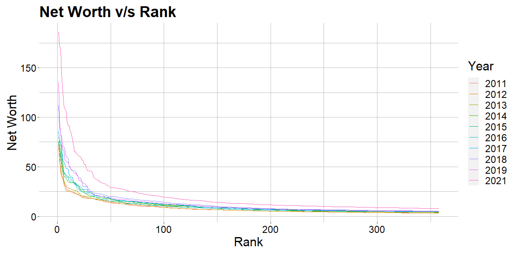

```{r setup, include=FALSE}
library(dplyr)
knitr::opts_chunk$set(echo = TRUE)
```

## About the Data

We scraped information about the top 500 billionaires of the world for the years 2011 to 2019 and 2021 from [Areppim](https://stats.areppim.com). Areppim is an information website that provides and analyses various kinds of data. It has collected data from [Forbes Billionaire List](https://www.forbes.com/billionaires) for data before 2019 and [Bloomberg Billionaires Index](https://www.bloomberg.com/billionaires) after 2019 (and including).

The variables extracted are as follows:

- **Name**
    - *character*
    - Person's name
- **Age**
    - *integer*
    - Person's age
- **Citizenship**
    - *factor* of countries
    - Person's citizenship
- **Net Worth**
    - *numeric*
    - The total market value of the assets removing the value of the liabilities associated to a person or an entity.
- **Source of Wealth**
    - *factor*
    - The wealth was acquired from what kind of industry. The industries have been grouped in the following categories:
        - Commodities
        - Consumer
        - Diversified
        - Energy
        - Entertainment
        - Finance
        - Food and Beverage
        - Health Care
        - Industrial
        - Media and Telecom
        - Real Estate
        - Retail
        - Services
        - Technology


The data consists of 500 rows across 10 years, thus, 5000 data points with 5 variables along with ordering indicating the rank.

We also have additional variables for every country for 2021:

- Population
- GDP
- Population Density
- GDP Growth Rate

and for every billionaire:

- Last Change YTD

To create the world map plots, we also created a data frame with the variables:

- Country Name
- 3-digit ISO Country Code ([ISO 3166-1 alpha-3](https://en.wikipedia.org/wiki/ISO_3166-1_alpha-3))

This data frame consists of 64 countries, the countries which had at least one billionaire in top 500 over the 10 years.


---

## Obtaining the Data

The data was obtained from the following sources:

- Main Data scraping from Areppim: [Link](https://stats.areppim.com/stats/links_billionairexlists.htm)
- Added Ages in the 2019 and 2021 datasets using Wikipedia pages of various billionaires.
- A *csv* was used from World Bank for data about various countries: [Link](https://data.worldbank.org/indicator/NY.GDP.MKTP.KD.ZG)
- A *csv* to obtain ISO country codes: [Link](https://raw.githubusercontent.com/plotly/datasets/master/2014_world_gdp_with_codes.csv)

Look at [`obtaining_data.html`](file://./../Code/obtaining_data.html) in the `Code` folder for the code of
scraping and processing the data.


---

## Biases in the Data:

- **Bias in Methodology:** We have scraped the data of 2011 to 2021 (except 2020) from [Areppim](https://stats.areppim.com/stats/links_billionairexlists.htm) website where it was mentioned that the data they are presenting was taken from **Bloomberg Billionaires Index** from 2019 and previously from **Forbes Billionaires List**.

  - The methodology of data collection of [Forbes](https://www.forbes.com/billionaires/) and [Bloomberg](https://www.bloomberg.com/billionaires/methodology/) is different.

  - Date of data collection of those websites was also different for those two websites. Since, the wealth of a person varies daily, some bias may have been introduced by this.

- **Bias in Categories of Source of Income:** The sources of wealth have been categorized under 14 categories. At times, a source of income could have belonged to two or more categories, in that case, the most relevant category was chosen.


---

## Interesting Questions

1. Which industry should be chosen to become a Billionaire?

2. Which place produces the most Billionaires?

3. Who are the top 10 billionaires in different years?

4. What is the distribution of Net worth among top 500 Billionaires?

5. In what way has the wealth of the top 10 richest people changed in the pandemic?

6. What is the distribution of age of the Billionaires?

7. What is the relation between Number of Billionaires and Population?

8. What is the relation between Number of Billionaires and GDP?

9. What is the relation between Billionaires Last change YTD and GDP Growth Rate?


---

## Important Visualisations


### **Which industry to choose to become a Billionaire?**


-    ##### **Finance** and **Retail** were the wealthiest industries until **Technology** overtook them in the recent years.
-    ##### And the Total Net Worth of the **Technology** increased exponentially in the 2019-21 period.

### **Which place produces the most Billionaires?**


-   ##### **China** and **United States** have higher number of billionaires and higher Total Worth than **Europian countries**. However, the Europian countries have higher Average Net Worth.
-   ##### Africa had the least number of billionaires.

### **Top 10 Billionaires Race:**


-   ##### Everyone's net worth has increased over the years.

-   ##### Elon Musk and Jeff Bezos jumped to the top positions in the recent years pushing Bill Gates down, with Elon Musk showing an exponential jump over the last 2 years.

### **Distribution of Net worth among top 500 Billionaires:**



-   ##### The Net Worth decreases exponentially as we go to the higher ranks.
-   ##### Even among the top 500, the maximum wealth is congested among the few highest billionaires.

### **Wealth of worlds 10 richest Doubled in Pandemic**


-   ##### A 1.5-2 times jump can be seen in just a span of 2 years during the covid era.

### **Distribution of age of the Billionaires:**


-   ##### The ages of the top 500 billionaires has roughly remain the same for last 10 years.
-   ##### Most of them belong to 40-80 age group.

### **Relation between Billionaires and their Country's Data**


-   ##### There seems to be no significant relation between Number of Billionaires and Population of the Country.


-   ##### There seems to be a positive corelation between Number of Billionaires and GDP.


-   ##### There seems to be no relation between Billionaires last change YTD and GDPGR.
-   ##### So, the positive correlation between Number of Billionaires and GDP was fully superficial

### **Male vs Female billionaires of the World**


-   ##### Out of the top billionaires, only 12.9% are women.

### **Male and Female Distribution**

```{r, echo=FALSE,out.width="50%",out.height="20%",fig.show='hold'}
knitr::include_graphics(c("BillionairesBySource.jpg","BillionairesByYear.jpg"))
```

-   ##### The female representation in the worlds' billionaires has been increasing over the past years.
-   ##### Food and beverages, and Fasion and Retail have the highest proportion of females.

---

## Conclusion

The answers to the posed questions are purely data-driven based on the visualizations. The highlights of our analysis were:

- Technology industry has had a huge jump in the 2019-21 period along with Elon Musk in the global ranking.
- As it turns out, having a high number of billionaires or a high total net worth in a country doesn't guarantee one would have the highest net worth there.
- Even among the Top 500, the Top 20-25 are the actually the most wealthy with much higher net worth as compared to others being ranked.
- In the period 2019-21, the Net Worth of the Top 20-25 has become 1.5-2 times.
- The Age range of 40-80 years has remained static over the years, and data doesn't indicate any change in this trend.
- There was no relation found between GDP of the country or the population with the Number or the Net Worth of the billionaires.
- Women representation remains low in the Top billionaires of the world.
- The proportion of women in the billionaires list has been increasing over the past 10 years.


---

## References

- **Sources of our Data:**
  - Areppim
    - https://stats.areppim.com/stats/links_billionairexlists.htm
  - Wikipedia
    - https://www.wikipedia.org/
  - World Bank
    - https://data.worldbank.org/indicator/NY.GDP.MKTP.KD.ZG
    - https://data.worldbank.org/indicator/NY.GDP.MKTP.CD

- **Some Visualisations**
  - Male v/s Female in Top Billionaires
    - https://www.statista.com/statistics/778577/billionaires-gender-distribution/
  - Male and Female Distribution
    - https://www.dailyfx.com/nas-100/the-race-to-billion-dollars.html/

- **Took help form:**
  - https://r-graph-gallery.com/
  - https://stackoverflow.com/
  - https://shiny.rstudio.com/gallery/
